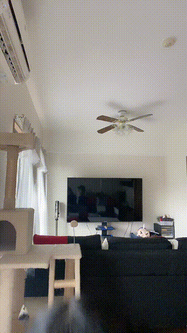
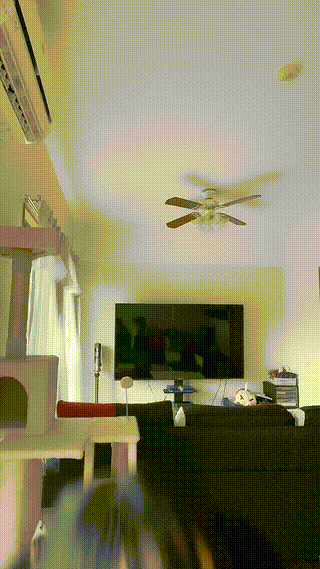
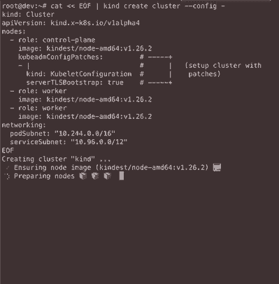

# How To High quality GIF with FFmpeg
Inspired by 
- [High quality GIF with FFmpeg](http://blog.pkh.me/p/21-high-quality-gif-with-ffmpeg.html)
- [How do I convert a video to GIF using ffmpeg, with reasonable quality?](https://superuser.com/questions/556029/how-do-i-convert-a-video-to-gif-using-ffmpeg-with-reasonable-quality)

Also
- [dergachev/screengif](https://github.com/dergachev/screengif)

Ask ChatGPT
- https://chat.forefront.ai/share/apshangez8v4ubbi
- https://poe.com/s/Gf3LXJsTvXA7GbiBAFiq

## simplest and most powerful

```shell
ffmpeg -i input.mp4 -vf scale=320:-1 -r 10 -f gif out-simple.gif
```

- `-vf scale=320:-1` scales the video to a width of 320 pixels and automatically calculates the height to preserve the aspect ratio
- `-r 10` sets the frame rate of the output GIF to 10 frames per second
- `-f gif` specifies the output format as GIF.

with `flags=lanczos` Uses the Lanczos resampling algorithm for better quality scaling

```shell
ffmpeg -i input.mp4 -vf "fps=10,scale=320:-1:flags=lanczos" -f gif out-lanczos.gif
```

## Other FFmpeg Optional

- `-ss 00:00:00.00 -t 5`: the start time of the clip and the duration of the clip

 optimize the GIF for a smaller file size while maintaining a clear image (We can experiment with different values for the resolution, color depth, and bitrate to find the optimal balance between file size and image quality for your needs.

- `-pix_fmt rgb8`: sets the color depth to 256 colors
- `-b:v 500K`: sets the maximum bitrate to 500 kilobits per second (adjust this value as needed)

## With palettegen and paletteuse filters

```shell
ffmpeg -i input.mp4 -vf "fps=10,scale=320:-1:flags=lanczos,palettegen=stats_mode=full:max_colors=128" palette.png && ffmpeg -i input.mp4 -i palette.png -filter_complex "fps=10,scale=320:-1:flags=lanczos[x];[x][1:v]paletteuse=dither=bayer:bayer_scale=3" -f gif out-palette.gif && rm palette.png
```

With palettegen and paletteuse

```bash
ffmpeg -i input.mp4 -vf "fps=10,scale=320:-1:flags=lanczos,palettegen=stats_mode=full:max_colors=128:quantizer=neuquant" palette.png && ffmpeg -i input.mp4 -i palette.png -filter_complex "fps=10,scale=320:-1:flags=lanczos[x];[x][1:v]paletteuse=dither=bayer:bayer_scale=3" -f gif out.gif
```

- `stats_mode=diff` compute histograms only for the part that differs from previous frame. This might be relevant to give more importance to the moving part of your input if the background is static. others options are `stats_mode=full`(default) ,  `stats_mode=single`
- `max_colors=128` Set the maximum number of colors to quantize in the palette, max 256
- `dither=bayer:bayer_scale=3`  bayer_scale ****range [0,5]. Default is 2. A low value means more visible pattern for less banding, and higher value means less visible pattern at the cost of more banding.
- `dither=floyd_steinberg` Floyd and Steingberg dithering (error diffusion)
- `dither=*sierra2_4a*` default

- The `paletteuse` filter has slightly more options to play with. The most obvious one is the dithering (`dither` option). The only predictable dithering available is `bayer`, all the others are error diffusion based.
    
> If you do want to use `bayer` (because you have a high speed or size issue), you can play with the `bayer_scale` option to lower or increase its crosshatch pattern.
    
> Of course, you can also completely disable the dithering by using `dither=none`.
    
> Concerning the error diffusal dithering, you will want to play with `floyd_steinberg`, `sierra2` and `sierra2_4a`. For more details on these, I'm redirecting you to [DHALF.TXT](http://www.efg2.com/Lab/Library/ImageProcessing/DHALF.TXT).
    
> For the lazy, `floyd_steinberg` is one of the most popular, and `sierra2_4a` is a fast/smaller version of `sierra2` (and is the default), diffusing through 3 pixels instead of 7. `heckbert` is the one documented in the paper I mentioned previously, and is just included as a reference (you probably won't want it).

Original 2.2M

simple (2.7M) <---> with lanczos (2.7M) <---> extra palette (4.0M)


## Optimize with gifsicle 

`--optimize=3`:Try several optimization methods (usually slower, sometimes better results).

`--lossy=100` :Alter image colors to shrink output file size at the cost of artifacts and noise. *Lossiness* determines how many artifacts are allowed; higher values can result in smaller file sizes, but cause more artifacts. The default *lossiness* 
is 20.

```shell
ffmpeg -i input.mp4 -vf scale=320:-1 -r 10 -f gif - | gifsicle --delay=10 --optimize=3 --lossy=100 --colors 128 > out-simple-gifsicle.gif

ffmpeg -i input.mp4 -vf "fps=10,scale=320:-1:flags=lanczos" -f gif - | gifsicle --delay=10 --optimize=3 --lossy=100 --colors 128 > out-lanczos-gifsicle.gif

ffmpeg -i input.mp4 -vf "fps=10,scale=320:-1:flags=lanczos,palettegen=stats_mode=full:max_colors=128" palette.png && ffmpeg -i input.mp4 -i palette.png -filter_complex "fps=10,scale=320:-1:flags=lanczos[x];[x][1:v]paletteuse=dither=bayer:bayer_scale=3" -f gif - | gifsicle --delay=10 --optimize=3 --lossy=100 --colors 128 > out-palette-gifsicle.gif && rm palette.png
```
Note `ImageMagick` can also do optimize.

Original 2.2M

gifsicle simple (2.6M) <---> gifsicle with lanczos (2.6M) <---> gifsicle extra palette (1.7M)





## Terminal GIF
```shell
{
ffmpeg -i kubelet-certs.mp4 -vf scale=399:-1 -r 10 -f gif  kubelet-certs-simple.gif

ffmpeg -i kubelet-certs.mp4 -vf "fps=10,scale=399:-1:flags=lanczos" -f gif kubelet-certs-lanczos.gif

ffmpeg -i kubelet-certs.mp4 -vf "fps=10,scale=399:-1:flags=lanczos,palettegen=stats_mode=diff:max_colors=4" palette.png && ffmpeg -i kubelet-certs.mp4 -i palette.png -filter_complex "fps=10,scale=399:-1:flags=lanczos[x];[x][1:v]paletteuse=dither=bayer:bayer_scale=3" -f gif kubelet-certs-palette.gif && rm palette.png

ffmpeg -i kubelet-certs.mp4 -vf scale=399:-1 -r 10 -f gif  - | gifsicle --delay=10 --optimize=3 --lossy=100 --colors 128 >  kubelet-certs-simple-gifsicle.gif

ffmpeg -i kubelet-certs.mp4 -vf "fps=10,scale=399:-1:flags=lanczos" -f gif - | gifsicle --delay=10 --optimize=3 --lossy=100 --colors 128 > kubelet-certs-lanczos-gifsicle.gif

ffmpeg -i kubelet-certs.mp4 -vf "fps=10,scale=399:-1:flags=lanczos,palettegen=stats_mode=diff:max_colors=4" palette.png && ffmpeg -i kubelet-certs.mp4 -i palette.png -filter_complex "fps=10,scale=399:-1:flags=lanczos[x];[x][1:v]paletteuse=dither=bayer:bayer_scale=3" -f gif - | gifsicle --delay=10 --optimize=3 --lossy=100 > kubelet-certs-palette-gifsicle.gif && rm palette.png
}
```

Original 7.0M

simple (1.8M) <---> with lanczos (1.8M) <---> extra palette (4.7M)




gifsicle simple (1.6M) <---> gifsicle with lanczos (1.7M) <---> gifsicle extra palette (3.2M)


## Conclusion
FFmpeg with `flags=lanczos`  + gifsicle always do the best, forget about palettegen and paletteuse filters plz